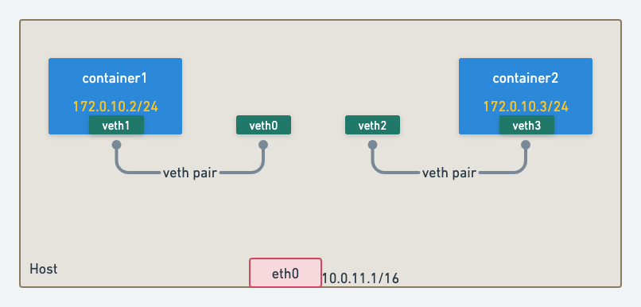
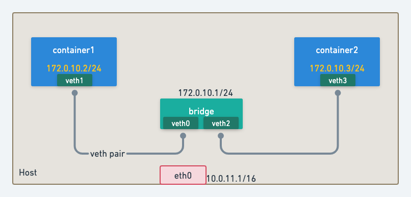
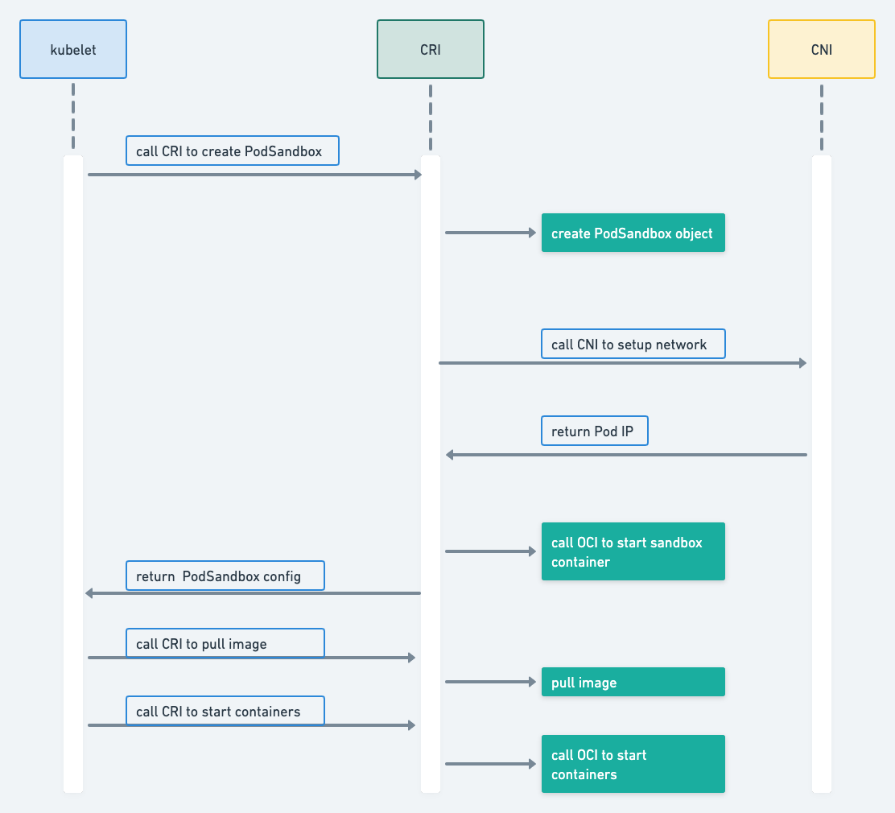

# Overview

With [CRI](https://github.com/LukeFrostmourne/deep-dive-into-k8s/blob/master/00-prerequisite/container-runtime.md) kubelet is able to manage containers, as for networking CRI delegates the task to [CNI](https://github.com/containernetworking/cni)(Container Network Interface). Similar to CRI, CNI is also an abstraction which allows different network providers to use different networking implementations for containers.


- [Overview](#overview)
- [Concept](#concept)
  * [k8s network model](#k8s-network-model)
  * [containers on the same host](#containers-on-the-same-host)
  * [containers on different hosts](#containers-on-different-hosts)
- [Pod creation](#pod-creation)
  * [start procedure](#start-procedure)
  * [network setup](#network-setup)
- [CNI plugins](#cni-plugins)

# Concept

## k8s network model

- each pod has its own IP
- each pod can talk to others with its IP

## containers on the same host

like servers in real world, we need 3 things to connect them:
- NIC
- cable
- switch

As mentioned in  [CRI](https://github.com/LukeFrostmourne/deep-dive-into-k8s/blob/master/00-prerequisite/container-runtime.md),  containers are just processes with namespaces, connecting containers means connecting network namespaces.

### [veth](https://man7.org/linux/man-pages/man4/veth.4.html)

Linux provides a feature to create virtual ethernet devices,

- creates a veth pair(just like an ethernet cable) with 2 end points(veth0 and veth1).
    
    ```bash
    ip link add veth0 type veth peer name veth1
    ```
    
- put one end into container namespace
    
    ```bash
    ip link set veth1 netns $CONTAINER_PID
    ip addr add dev veth1 172.0.10.2/24
    ip link set veth1 up
    ```
    

do the same thing for other containers, then we will have:



### [Linux bridge](https://wiki.archlinux.org/title/Network_bridge)

Linux provides a feature to create virtual L2 switch.

- create a bridge
    
    ```bash
    ip link add cni0 type bridge
    ip addr add dev cni0 172.0.10.1/24
    ip link set cni0 up
    ```
    
- plug veth ends to bridge
    
    ```bash
    ip link set veth0 master cni0
    ip link set veth2 master cni0
    ```

Now containers are connected by this bridge



[*how it works*](https://docs.google.com/presentation/d/1NDoV7xa9gM2llAwnfCpGj6dF5klbyy4akgq_2ul9NLA/edit#slide=id.g489fb6edd3_0_350)

## containers on different hosts

There are many ways(vxlan, iptables etc.) to communicate with containers on other hosts.

Use [VXLAN](https://en.wikipedia.org/wiki/Virtual_Extensible_LAN) (virtual L2 network over L3 network, it encapsulates L2 frames with L3 packets) as an example.


src IP: 172.0.10.2 → dst IP: 172.0.11.2

1. Inside container1 
    
    The default gateway is the bridge, so packet will go to cni0(bridge) first (from container namespace to host namespace).
    
    ```bash
    # route
    Destination     Gateway         Genmask         Flags Metric Ref    Use Iface
    default         172.0.10.1      0.0.0.0         UG    0      0        0 eth0
    ```
    
2. Bridge
    
    Find the next hop based on routing table, so packet will go to device vtep.
    
    ```bash
    Destination     Gateway         Genmask         Flags Metric Ref    Use Iface
    ...
    172.0.11.0      172.0.11.0      255.255.255.0   UG    0      0        0 vtep
    ```
    
    <aside>
    💡 whenever a new node is added or old node is deleted, routing table must be updated.
    
    </aside>
    
    VTEP is like this(flannel example):
    
    ```bash
    4: flannel.1: <BROADCAST,MULTICAST,UP,LOWER_UP> mtu 1450 qdisc noqueue state UNKNOWN mode DEFAULT group default 
        link/ether 8e:d0:f8:0a:41:19 brd ff:ff:ff:ff:ff:ff promiscuity 0 
        vxlan id 1 local 172.16.0.5 dev eth0 srcport 0 0 dstport 8472 nolearning ageing 300 udpcsum addrgenmode eui64
    ```
    
3. VTEP gets MAC of 172.0.11.0 by checking APR table.
    
    ```bash
    172.0.11.0 lladdr xxxx PERMANENT
    ```
    
    <aside>
    💡 APR table must be updated in time.
    
    </aside>
    
4. Get dst IP based on FDB → 10.0.11.2
    
    ```bash
    xxx dev vtep dst 10.0.11.2 port 8472 self permanent
    ```
    
    <aside>
    💡 FDB must be updated in time.
    
    </aside>
    
5. VTEP add its header(it also adds dstport which is the port VTEP listens to) to the packet and send it to host2.
6. Host2 eth0 gets the packet and send it host2 VTEP because of the dport.
7. VTEP decapsulates the packet and send it to cni0 based on the routing table
8. Bridge sends the packet to container3

# Pod creation

## start procedure



1. call CRI to create [PodSanbox](https://github.com/kubernetes/kubernetes/blob/master/pkg/kubelet/kuberuntime/kuberuntime_manager.go#L806).
    
    > A Pod is composed of a group of application containers in an isolated environment with resource constraints. In CRI, this environment is called PodSandbox.
    > 
    
    It hosts the pod-level resources(IPC, network, PID etc.) that workload containers will use and also sets cgroups.
    
2. create [Sandbox object](https://github.com/containerd/containerd/blob/main/pkg/cri/server/sandbox_run.go#L85).
3. call CNI to [setup network](https://github.com/containerd/containerd/blob/main/pkg/cri/server/sandbox_run.go#L165).
4. call OCI(runc) to [start sandbox container](https://github.com/containerd/containerd/blob/main/pkg/cri/server/sandbox_run.go#L327). 
5. pull images
    
    [kubernetes/kuberuntime_container.go at master · kubernetes/kubernetes](https://github.com/kubernetes/kubernetes/blob/master/pkg/kubelet/kuberuntime/kuberuntime_container.go#L177)
    
    [containerd/image_pull.go at main · containerd/containerd](https://github.com/containerd/containerd/blob/main/pkg/cri/server/image_pull.go#L92)
    
6. call OCI to [start containers](https://github.com/containerd/containerd/blob/main/pkg/cri/server/container_start.go#L42)

## network setup

CRI plugin invokes CNI plugin to setup network.

- which CNI plugin to use?
    
    it will lookup `/etc/cni/net.d/<config-file>` , for example (aws-cni)
    
    ```bash
    [root@ip-10-0-75-41 ec2-user]# cat /etc/cni/net.d/10-aws.conflist
    {
      "cniVersion": "0.3.1",
      "name": "aws-cni",
      "plugins": [
        {
          "name": "aws-cni",
          "type": "aws-cni",
          "vethPrefix": "eni",
          "mtu": "9001",
          "pluginLogFile": "/var/log/aws-routed-eni/plugin.log",
          "pluginLogLevel": "DEBUG"
        },
        {
          "type": "portmap",
          "capabilities": {"portMappings": true},
          "snat": true
        }
      ]
    }
    ```
    
- how is it configured?
    
    usually cni plugin uses an [init](https://github.com/aws/amazon-vpc-cni-k8s/blob/master/scripts/init.sh) container to setup config and binaries.
    
    ```yaml
    initContainers:
    - name: aws-vpc-cni-init
      image: "602401143452.dkr.ecr.us-west-2.amazonaws.com/amazon-k8s-cni-init:v1.9.3"
    ```
    
    CRI will run the CNI plugin in binary directory.
    
    ```bash
    [root@ip-10-0-75-41 ec2-user]# ls /opt/cni/bin/
    aws-cni  aws-cni-support.sh  bandwidth  bridge  dhcp  firewall  flannel  host-device  host-local  ipvlan  loopback  macvlan  portmap  ptp  sbr  static  tuning  vlan
    ```
    

# CNI plugins

- AWS-CNI 

- Flanel

- Cilium
